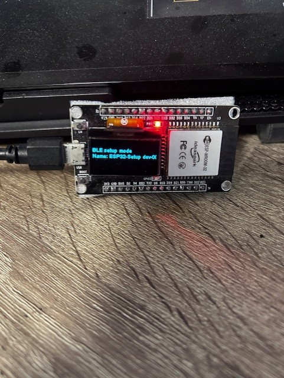
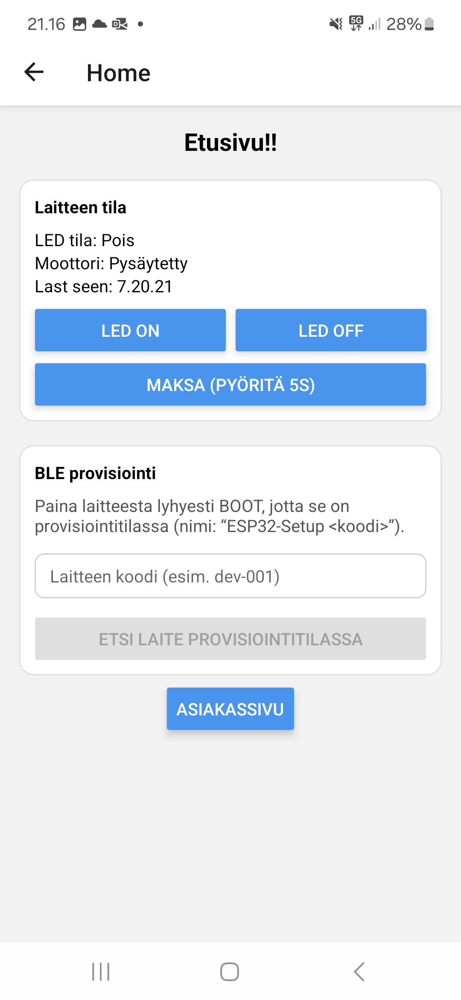
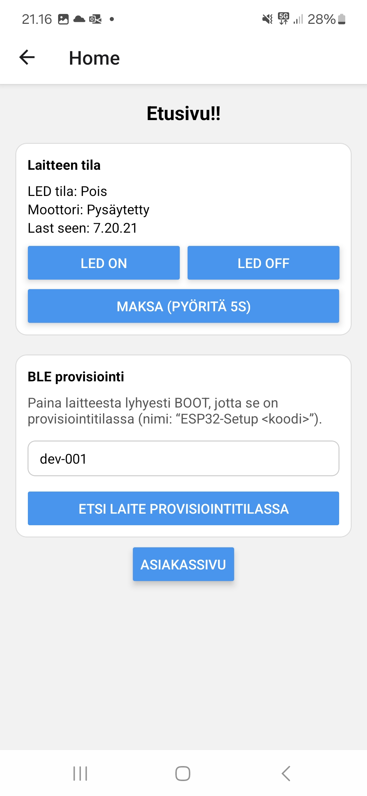
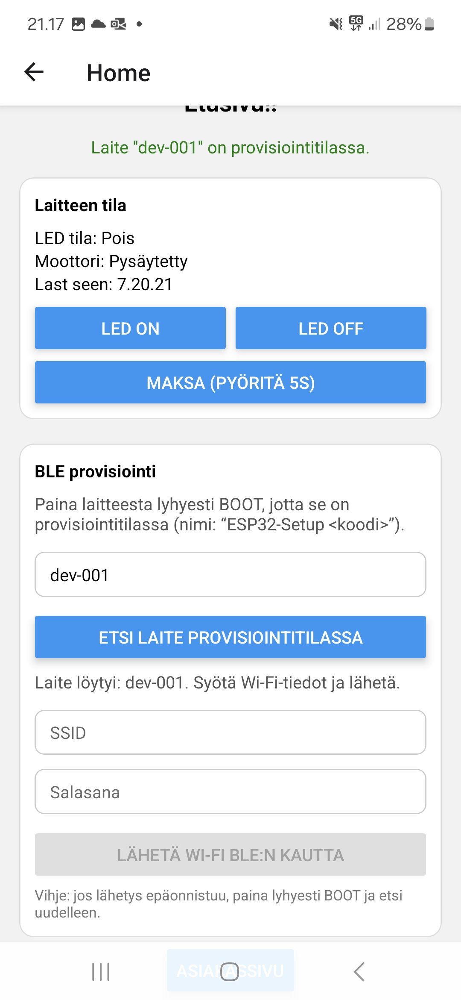
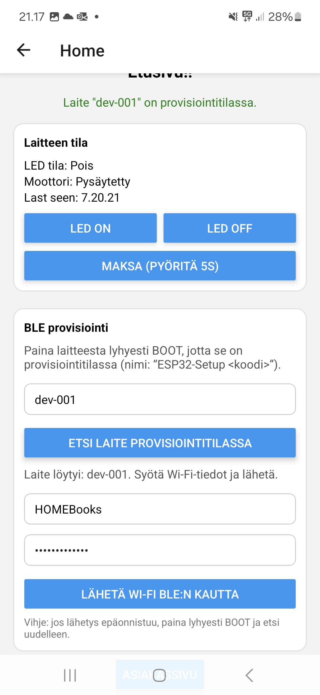
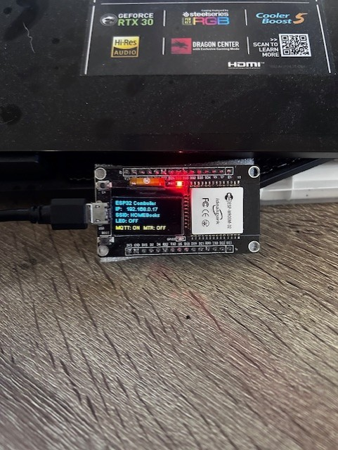
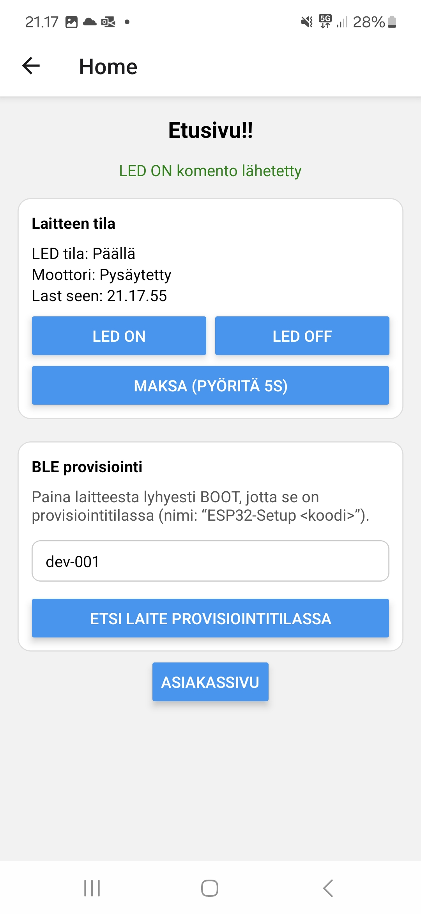
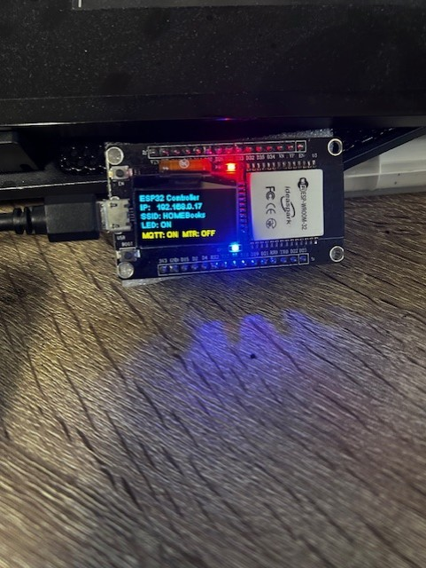
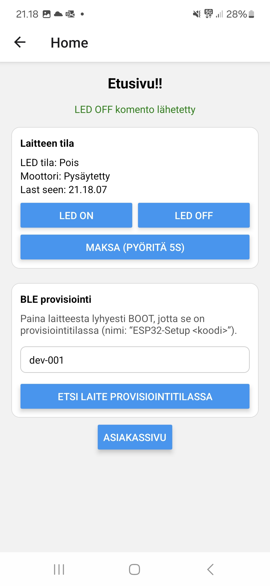
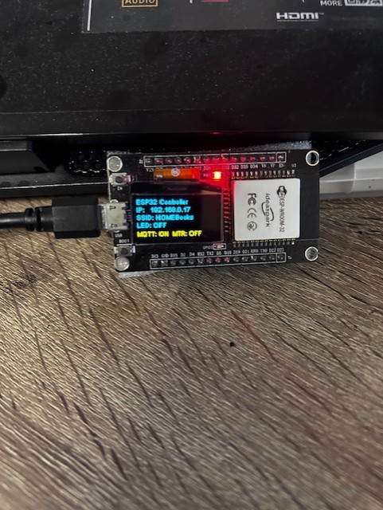

# Cold Pack Vending Machine – React Native App

##  Overview
This project is a **React Native (Expo) mobile application** designed to control and monitor a **cold pack vending machine** located inside a freezer.  
The application communicates with embedded devices (ESP32) and a backend service to enable **remote control, device provisioning, and real-time status monitoring**.

The goal of the project is to create a **scalable IoT-based vending solution** that can be managed remotely via a mobile app.

---

## 🔗 ESP32 BLE Provisioning Flow

### 1️⃣ ESP32 in BLE Provisioning Mode
The ESP32 starts in **BLE provisioning mode** and displays a device code on the screen, for example:

**`dev-001`**



---

### 2️⃣ Search for the Device in the Mobile App
Enter the device code provided by the ESP32 (**dev-001**) into the **"BLE Provisioning"** input field and press **"Search device in provisioning mode"**.




---

### 3️⃣ Send Wi-Fi Credentials via BLE
When the application successfully finds the ESP32, enter the **Wi-Fi SSID** and **password**, then press **"Send Wi-Fi via BLE"**.

The credentials are securely transmitted to the ESP32 using Bluetooth Low Energy.




---

### 4️⃣ ESP32 Connected to Wi-Fi
After a successful connection, the ESP32 displays the **connected Wi-Fi network details** on the screen.



---

### 5️⃣ Control the ESP32 LED
From this view, you can control the **blue LED** connected to the ESP32.




---

### 6️⃣ Turn the LED Off
The LED can also be turned **off** directly from the application.





##  Project Purpose
The application allows users to:
- Connect the vending machine to a Wi-Fi network
- Control motors and mechanisms inside the freezer
- Monitor device status and sensors
- Send commands to the machine securely
- Support future expansion for multiple devices and locations

This project is part of a larger system that combines **hardware, firmware, backend services, and a mobile application**.

---

##  Tech Stack

### Mobile App
- React Native
- Expo
- TypeScript / JavaScript
- Axios / Fetch API
- React Navigation

### Embedded Devices
- ESP32 (Wi-Fi & BLE)
- Stepper motors
- Sensors (Hall sensors, magnetic contacts, etc.)


### Backend (separate repository)
- Node.js
- Express
- REST / MQTT communication
- Database (MongoDB / SQL)

---

## Installation

### Prerequisites
- Node.js (LTS recommended)
- Expo CLI
- Android Studio or Xcode (for emulators)
- Physical device (recommended for hardware testing)

### Install dependencies
```bash
npm install